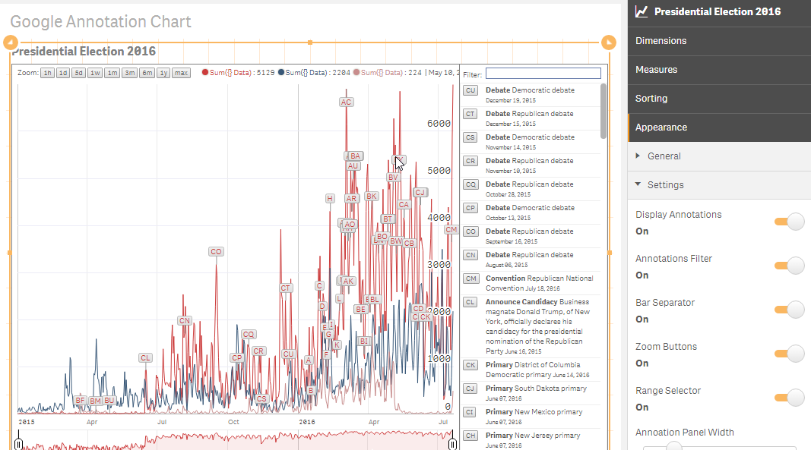

# Google Annotation Chart extension for Qlik Sense
A Google Annotation Chart extension for Qlik Sense as found at
[https://developers.google.com/chart/interactive/docs/gallery/annotationchart](https://developers.google.com/chart/interactive/docs/gallery/annotationchart)

## Installation
- Desktop - Unzip at the extension folder (C:\Users\<user>\Documents\Qlik\Sense\Extensions\GoogleAnnotationChart) 
- Server - Upload the zip file

## Usage

##### Dimensions and Measures
- add up to 3 dimensions with this order
  1. Date - for the X-Axis
  2. Annotation Title
  3. Annotation Description
- Add up to 4 measures for the each line that you want

##### Extension Settings
- Coming up

